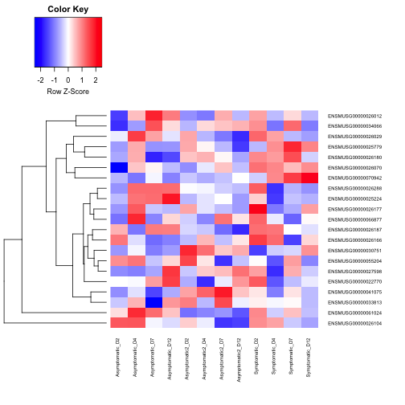

Gene_viewer
========================================================
author: Richard Green
date: 11/14/15

Introduction
========================================================
Its often important in fields like personalized medicine,

Genetics, Computational Biology/Bioinformatics to be able

to look at genomic signatures (different genes) that are 

changing as a result of different experimental condtions.

The challenge
========================================================
A common challenge is the ability to be able to look at different genetic

changes, but when youre running an analysis for someone its easier to create something that is 

interactive and allows the user to apply different conditions through a tool like shiny

Our design
========================================================
Lets build into our design all the different ways we would like to evaluate our biological data
and the build that into our shiny app. Lets say we want to look at

- Global heatmap: all genes that changing across conditions
- Innate Immune signatures: specific set of genes invloved in the early immune response
- Immune signatures: A broader list of genes involved in early and late immune response
- Select subjects that are just not symptomatic to the disease (resistant)
- Select subjects that are just symptomatic to the disease (susceptible)

Our approach
========================================================
First we will start by loading the packages we need and the data, which is a large set of gene 

signatures that we know are statistically significant across our different gene backgrounds. This 

is public microarray data isolated from mouse spleens infected with west nile virus.


```r
library(shiny)
library(limma)

array <- read.csv(file="spleen_DE.csv", header=T)
row.names(array) <- array$X

array <- array[c(1:500),-1]
```
We have loaded up the gene names as row names and then removed that column. We have also selected
the first 500 genes in our matrix to work off of.

Generating results
========================================================
Now that we have our data loaded we can write functions that will subset the gene signatures based off of our preferances (specified in slide 3). For example if I wanted to subset my raw data 
for genes that are only known to be invloved with innate immune function, I'll upload a list of those gene ids and then filter my array. In the next slide I'll display the matrix with a built in toolcalled heatmap.2 from the package gplots.


```r
library(shiny)
library(limma)
library(gplots)

array <- read.csv(file="spleen_DE.csv", header=T)
row.names(array) <- array$X

array <- array[c(1:500),-1]

immune <- read.csv(file="immune.csv", header=T)
        
        array <- array[row.names(array) %in% immune$ensembl_gene_id,]
```

Visualizing results
========================================================
Below we can see specific gene signatures invloved in innate immunity, how they are clustered
by their directonality by color and dendogram ,and the x-axis shows us the different outcomes of the animals by timepoint. Those animals that are non symptomatic, symptomatic over days 2 through 12. 

```r
        heatmap.2(as.matrix(array), col = bluered(256), scale="row", key=T, keysize=1.5,density.info="none",trace="none",cexCol=0.6, cexRow=0.6,labRow=row.names(array), Colv=FALSE, dendrogram="row", margin=c(8,9))
```

 
